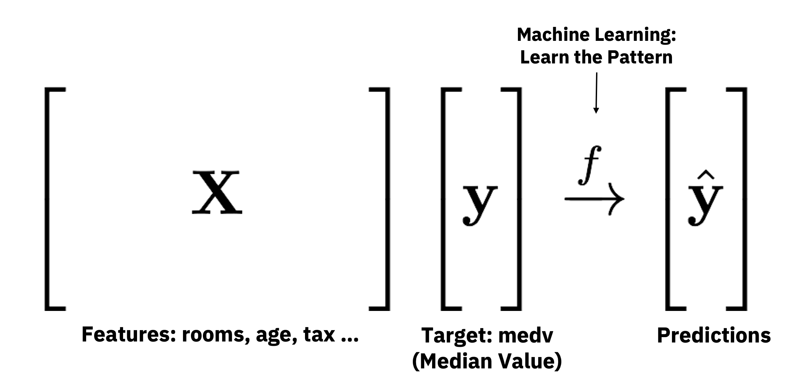

```{r knitr_init, echo=FALSE, cache=FALSE}
library(knitr)
library(rmdformats)
library(DT)

## Global options
options(max.print="75")
opts_chunk$set(echo=TRUE,
	             cache=FALSE,
               prompt=FALSE,
               tidy=TRUE,
               comment=NA,
               message=FALSE,
               warning=FALSE)
opts_knit$set(width=75)
```

# Agenda

- 09:00 to 09:30 Set Up & Introduction
- 09:30 to 10:30 Regression Example
- 10:30 to 11:00 Coffee Break
- 11:00 to 11:30 Classification Example
- 11:30 to 12:30 Bring Your Own Data + Q&A


# Set Up

## Download -> bit.ly/useR2019_h2o_tutorial

- `setup.R`: install packages required
- `tutorial.Rmd`: the main RMarkdown file with code 
- `tutorial.html`: this webpage
- **GitHub Repo** https://github.com/woobe/IAGLR_2021_H2O_Workshop


## R Packages

- Check out `setup.R`
- For this tutorial:
    - `h2o` for automatic and explainable machine learning
- For RMarkdown
    - `knitr` for rendering this RMarkdown
    - `rmdformats` for `readthedown` RMarkdown template
    - `DT` for nice tables


# Introduction

General Data Protection Regulation (GDPR) is now in place. Are you ready to explain your models? This is a hands-on tutorial for R beginners. I will demonstrate the use of H2O and other R packages for automatic and interpretable machine learning. Participants will be able to follow and build regression and classification models quickly with H2O's AutoML. They will then be able to explain the model outcomes with various methods.

It is a workshop for R beginners and anyone interested in machine learning. RMarkdown and the rendered HTML will be provided so everyone can follow without running the code.


# H2O Basics

```{r, message=FALSE}
# Let's go
library(h2o) # for H2O Machine Learning
```

## Start a local H2O Cluster (JVM)

```{r}
h2o.init()
```

```{r}
h2o.no_progress() # disable progress bar for RMarkdown
h2o.removeAll()   # Optional: remove anything from previous session 
```


```{r}
# Enter your lucky seed here ...
n_seed <- 12345
```


# Data - Dom Lake Huron Abund

```{r}
lake_data <- h2o.importFile('https://raw.githubusercontent.com/woobe/IAGLR_2021_H2O_Workshop/main/data/Dom_Lake_Huron_Abund.csv')
```

```{r}
datatable(as.data.frame(head(lake_data)), rownames = FALSE, options = list(pageLength = 10, scrollX = TRUE, round)) %>%
  formatRound(columns = -1, digits = 4)
```


```{r}
h2o.describe(lake_data)
```

```{r}
h2o.hist(lake_data$DPOL, breaks = 100)
```


```{r}
h2o.hist(lake_data$DBUG, breaks = 100)
```

## Define Target and Features

```{r}
target_DPOL <- "DPOL"
target_DBUG <- "DBUG"

# Remove targets, C1, and Dreisseniidae (which is DPOL + DBUG)
features <- setdiff(colnames(lake_data), c(target_DPOL, target_DBUG, "C1", "Dreisseniidae"))

print(features)
```

<center>

</center>


## Split Data into Train/Test

```{r}
h_split <- h2o.splitFrame(lake_data, ratios = 0.8, seed = n_seed)
h_train <- h_split[[1]] # 80% for modelling
h_test <- h_split[[2]] # 20% for evaluation
```

```{r}
dim(h_train)
dim(h_test)
```

## Cross-Validation

<center>

</center>


# Regression Example - Target "DPOL"

### Baseline Models

- `h2o.glm()`: H2O Generalized Linear Model
- `h2o.randomForest()`: H2O Random Forest Model
- `h2o.gbm()`: H2O Gradient Boosting Model
- `h2o.deeplearning()`: H2O Deep Neural Network Model 
- `h2o.xgboost()`: H2O wrapper for eXtreme Gradient Boosting Model (XGBoost) from DMLC

Let's start with GBM

```{r}
model_gbm_DPOL <- h2o.gbm(x = features,               # All 13 features
                              y = target_DPOL,            # medv (median value of owner-occupied homes in $1000s)
                              training_frame = h_train,   # H2O dataframe with training data
                              model_id = "baseline_gbm",  # Give the model a name
                              nfolds = 5,                 # Using 5-fold CV
                              seed = n_seed)              # Your lucky seed
```

```{r}
# Cross-Validation
model_gbm_DPOL@model$cross_validation_metrics
```


```{r}
# Evaluate performance on test
h2o.performance(model_gbm_DPOL, newdata = h_test)
```

Let's use RMSE

<center>

</center>


### Build Other Baseline Models (GLM, DRF, GBM, DNN) - TRY IT YOURSELF!

```{r eval=FALSE}
# Try other H2O models
# model_glm <- h2o.glm(x = features, y = target, ...)
# model_gbm <- h2o.gbm(x = features, y = target, ...)
# model_drf <- h2o.randomForest(x = features, y = target, ...)
# model_dnn <- h2o.deeplearning(x = features, y = target, ...)
# model_xgb <- h2o.xgboost(x = features, y = target, ...)
```


## Manual Tuning

### Check out the hyper-parameters for each algo

```{r, eval=FALSE}
?h2o.glm 
?h2o.randomForest
?h2o.gbm
?h2o.deeplearning
?h2o.xgboost
```

### Train a xgboost model with manual settings

```{r}
model_gbm_DPOL_m <- h2o.gbm(x = features, 
                                y = target_DPOL, 
                                training_frame = h_train,
                                model_id = "model_gbm_m", 
                                nfolds = 5,
                                seed = n_seed,
                                # Manual Settings based on experience
                                learn_rate = 0.1,       # use a lower rate (more conservative)
                                ntrees = 100,           # use more trees (due to lower learn_rate)
                                sample_rate = 0.9,     # use random n% of samples for each tree  
                                col_sample_rate = 0.9) # use random n% of features for each tree
```

### Comparison (RMSE: Lower = Better)


```{r}
# Create a table to compare RMSE from different models
d_eval <- data.frame(model = c("GBM: Gradient Boosting Model (Baseline)",
                               "GBM: Gradient Boosting Model (Manual Settings)"),
                     stringsAsFactors = FALSE)
d_eval$RMSE_cv <- NA
d_eval$RMSE_test <- NA
```

```{r}
# Store RMSE values
d_eval[1, ]$RMSE_cv <- model_gbm_DPOL@model$cross_validation_metrics@metrics$RMSE
d_eval[2, ]$RMSE_cv <- model_gbm_DPOL_m@model$cross_validation_metrics@metrics$RMSE

d_eval[1, ]$RMSE_test <- h2o.rmse(h2o.performance(model_gbm_DPOL, newdata = h_test))
d_eval[2, ]$RMSE_test <- h2o.rmse(h2o.performance(model_gbm_DPOL_m, newdata = h_test))
```

```{r}
# Show Comparison (RMSE: Lower = Better)
datatable(d_eval, rownames = FALSE, options = list(pageLength = 10, scrollX = TRUE, round)) %>%
  formatRound(columns = -1, digits = 4)
```


## Hierarchical GLM (HGLM) with Random Effects 

```{r, eval=FALSE}
# Not working yet ...
# model_hglm_DPOL <- h2o.glm(x = features,
#                            y = target_DPOL,
#                            training_frame = h_train,
#                            model_id = "model_hglm", 
#                            seed = n_seed,
#                            family = "gaussian",
#                            rand_family = c("gaussian"),
#                            rand_link = c("identity"),
#                            HGLM = TRUE,
#                            random_columns = "Year",
#                            calc_like = TRUE)
```


## H2O AutoML

```{r}
# Run AutoML (try n different models)
# Check out all options using ?h2o.automl
automl_DPOL = h2o.automl(x = features,
                         y = target_DPOL,
                         training_frame = h_train,
                         nfolds = 5,                     # 5-fold Cross-Validation
                         max_models = 20,                # Max number of models
                         stopping_metric = "RMSE",       # Metric to optimize
                         project_name = "automl_DPOL", # Specify a name so you can add more models later
                         seed = n_seed)
```

### Leaderboard

```{r}
datatable(as.data.frame(automl_DPOL@leaderboard), 
          rownames = FALSE, options = list(pageLength = 10, scrollX = TRUE, round)) %>%
  formatRound(columns = -1, digits = 4)
```

### Best Model (Leader)

```{r}
automl_DPOL@leader
```

### Comparison (RMSE: Lower = Better)

```{r}
d_eval_tmp <- data.frame(model = "Best Model from H2O AutoML",
                         RMSE_cv = automl_DPOL@leader@model$cross_validation_metrics@metrics$RMSE,
                         RMSE_test = h2o.rmse(h2o.performance(automl_DPOL@leader, newdata = h_test)))
d_eval <- rbind(d_eval, d_eval_tmp)

datatable(d_eval, rownames = FALSE, options = list(pageLength = 10, scrollX = TRUE, round)) %>%
  formatRound(columns = -1, digits = 4)
```


## Make Predictions

```{r}
yhat_test <- h2o.predict(automl_DPOL@leader, newdata = h_test)
head(yhat_test)
```


## Explainable AI - Target "DPOL"

### Global Explanations

```{r}
# Explain Manually Tuned GBM
h2o.explain(model_gbm_DPOL_m, newdata = h_test)
```


### Local Explanations

### Local Contributions (for Tree-based Models)

```{r}
predictions <- h2o.predict(model_gbm_DPOL_m, newdata = h_test)
as.data.frame(head(predictions, 5))
```

```{r}
contributions <- h2o.predict_contributions(model_gbm_DPOL_m, newdata = h_test)

datatable(as.data.frame(head(contributions)), rownames = FALSE, options = list(pageLength = 10, scrollX = TRUE, round)) %>%
  formatRound(columns = -1, digits = 4)
```


# Regression Example - Target "DBUG"

T.B.A.

# Bring Your Own Data + Q&A

Get your hands dirty!

