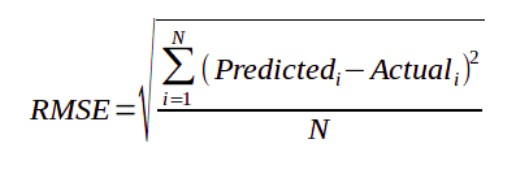

```{r knitr_init, echo=FALSE, cache=FALSE}
library(knitr)
library(rmdformats)
library(DT)

## Global options
options(max.print="75")
opts_chunk$set(echo=TRUE,
	             cache=FALSE,
               prompt=FALSE,
               tidy=TRUE,
               comment=NA,
               message=FALSE,
               warning=FALSE)
opts_knit$set(width=75)
```

# Agenda

- Welcomes and introductions – Timothy Maguire (UMich CIGLR) and Jo-fai Chow (H2O.ai) (5 mins)
- Great Lakes research questions driven by data – Timothy Maguire (15 mins)
- Introduction to the H2O.ai software – Jo-fai Chow (5 mins)
- Live-code example of data manipulation and machine learning analysis –  Jo-Fai Chow (20 mins)
- Results in context – Timothy Maguire (10 mins)
- Q&A (5 mins)


# Welcome

<center>

</center>


# About Great Lakes Research


<center>


</center>

# Introduction to H2O

<center>


</center>


# Software and Code

## Code

- `setup.R`: install packages required
- `tutorial.Rmd`: the main RMarkdown file with code 
- `tutorial.html`: this webpage
- **GitHub Repo** https://github.com/woobe/IAGLR_2021_H2O_Workshop

## R Packages

- Check out `setup.R`
- For this tutorial:
    - `h2o` for automatic and explainable machine learning
- For RMarkdown
    - `knitr` for rendering this RMarkdown
    - `rmdformats` for `readthedown` RMarkdown template
    - `DT` for nice tables


# H2O Basics

```{r, message=FALSE}
# Let's go
library(h2o) # for H2O Machine Learning
```

## Start a local H2O Cluster (JVM)

```{r}
h2o.init()
```

```{r}
# Optional settings
h2o.no_progress() # disable progress bar for RMarkdown
h2o.removeAll()   # Optional: remove anything from previous session 
```


```{r}
# Enter your lucky seed here ...
n_seed <- 12345
```


# Data - Dom Lake Huron Abund

```{r}
# Import CSV from GitHub
lake_data <- h2o.importFile('https://raw.githubusercontent.com/woobe/IAGLR_2021_H2O_Workshop/main/data/Dom_Lake_Huron_Abund.csv')
```

```{r}
# Show first few samples
kable(head(lake_data, 5))
```


```{r}
h2o.describe(lake_data)
```

```{r}
h2o.hist(lake_data$DPOL, breaks = 100)
```


```{r}
h2o.hist(lake_data$DBUG, breaks = 100)
```

## Define Target and Features

```{r}
# Define targets
target_DPOL <- "DPOL"
target_DBUG <- "DBUG"

# Remove targets, C1, and Dreisseniidae (which is DPOL + DBUG)
features <- setdiff(colnames(lake_data), c(target_DPOL, target_DBUG, "C1", "Dreisseniidae"))

print(features)
```

<center>

</center>


## Split Data into Train/Test

```{r}
h_split <- h2o.splitFrame(lake_data, ratios = 0.75, seed = n_seed)
h_train <- h_split[[1]] # 80% for modelling
h_test <- h_split[[2]] # 20% for evaluation
```

```{r}
dim(h_train)
dim(h_test)
```

## Cross-Validation

<center>

</center>


# Worked Example - Target "DPOL"

## Baseline Regression Models

- `h2o.glm()`: H2O Generalized Linear Model
- `h2o.randomForest()`: H2O Random Forest Model
- `h2o.gbm()`: H2O Gradient Boosting Model
- `h2o.deeplearning()`: H2O Deep Neural Network Model 
- `h2o.xgboost()`: H2O wrapper for eXtreme Gradient Boosting Model (XGBoost) from DMLC

Let's start with GBM

```{r}
# Build a default (baseline) GBM
model_gbm_DPOL <- h2o.gbm(x = features,                   # All features
                          y = target_DPOL,            # Target
                          training_frame = h_train,   # H2O dataframe with training data
                          nfolds = 5,                 # Using 5-fold CV
                          seed = n_seed)              # Your lucky seed
```

```{r}
# Cross-Validation
model_gbm_DPOL@model$cross_validation_metrics
```


```{r}
# Evaluate performance on test
h2o.performance(model_gbm_DPOL, newdata = h_test)
```

Let's use RMSE

<center>

</center>


Build Other Baseline Models (GLM, DRF, GBM, DNN) - TRY IT YOURSELF!

```{r eval=FALSE}
# Try other H2O models
# model_glm <- h2o.glm(x = features, y = target, ...)
# model_gbm <- h2o.gbm(x = features, y = target, ...)
# model_drf <- h2o.randomForest(x = features, y = target, ...)
# model_dnn <- h2o.deeplearning(x = features, y = target, ...)
# model_xgb <- h2o.xgboost(x = features, y = target, ...)
```


## Manual Tuning

### Check out the hyper-parameters for each algo

```{r, eval=FALSE}
?h2o.glm 
?h2o.randomForest
?h2o.gbm
?h2o.deeplearning
?h2o.xgboost
```

### Train a xgboost model with manual settings

```{r}
model_gbm_DPOL_m <- h2o.gbm(x = features, 
                            y = target_DPOL, 
                            training_frame = h_train,
                            nfolds = 5,
                            seed = n_seed,
                                
                            # Manual Settings based on experience
                            learn_rate = 0.1,       # use a lower rate (more conservative)
                            ntrees = 120,           # use more trees (due to lower learn_rate)
                            sample_rate = 0.7,      # use random n% of samples for each tree  
                            col_sample_rate = 0.7)  # use random n% of features for each tree
```

### Comparison (RMSE: Lower = Better)


```{r}
# Create a table to compare RMSE from different models
d_eval <- data.frame(model = c("GBM: Gradient Boosting Model (Baseline)",
                               "GBM: Gradient Boosting Model (Manual Settings)"),
                     stringsAsFactors = FALSE)
d_eval$RMSE_cv <- NA
d_eval$RMSE_test <- NA

# Store RMSE values
d_eval[1, ]$RMSE_cv <- model_gbm_DPOL@model$cross_validation_metrics@metrics$RMSE
d_eval[2, ]$RMSE_cv <- model_gbm_DPOL_m@model$cross_validation_metrics@metrics$RMSE
d_eval[1, ]$RMSE_test <- h2o.rmse(h2o.performance(model_gbm_DPOL, newdata = h_test))
d_eval[2, ]$RMSE_test <- h2o.rmse(h2o.performance(model_gbm_DPOL_m, newdata = h_test))

# Show Comparison (RMSE: Lower = Better)
kable(d_eval)
```


## H2O AutoML

```{r}
# Run AutoML (try n different models)
# Check out all options using ?h2o.automl
automl_DPOL = h2o.automl(x = features,
                         y = target_DPOL,
                         training_frame = h_train,
                         nfolds = 5,                        # 5-fold Cross-Validation
                         max_models = 30,                   # Max number of models
                         stopping_metric = "RMSE",          # Metric to optimize
                         exclude_algos = c("deeplearning", "xgboost"), # exclude some algos for a quick demo
                         seed = n_seed)
```

### Leaderboard

```{r}
# Show the table
kable(as.data.frame(automl_DPOL@leaderboard))
```

### Best Model (Leader)

```{r}
# Show the best model
automl_DPOL@leader
```

### Comparison (RMSE: Lower = Better)

```{r}
d_eval_tmp <- data.frame(model = "Best Model from H2O AutoML",
                         RMSE_cv = automl_DPOL@leader@model$cross_validation_metrics@metrics$RMSE,
                         RMSE_test = h2o.rmse(h2o.performance(automl_DPOL@leader, newdata = h_test)))
d_eval <- rbind(d_eval, d_eval_tmp)

# Show the table
kable(d_eval)
```


## Making Predictions

```{r}
# Make predictions
yhat_test <- h2o.predict(automl_DPOL@leader, newdata = h_test)

# Show the table
kable(head(yhat_test, 5))
```


## Explainable AI (Results in Context)

### Global Explanations

```{r}
# Show global explanations for best model from AutoML
h2o.explain(automl_DPOL@leader, newdata = h_test)
```


### Local Explanations

```{r}
# Show local explanations
h2o.explain_row(automl_DPOL@leader, newdata = h_test, row_index = 1)
```

### Local Contributions

```{r}
# Make Predictions
predictions <- h2o.predict(automl_DPOL@leader, newdata = h_test)

# Show the table
kable(head(predictions, 5))
```

```{r}
# Calculate feature contributions for each sample
contributions <- h2o.predict_contributions(automl_DPOL@leader, newdata = h_test)

# Show the table
kable(head(contributions, 5))
```


# Quick Recap

<center>


</center>

## Learning Resources

- H2O Documentation: https://docs.h2o.ai/h2o/latest-stable/h2o-docs/index.html
- H2O Learning Center: https://training.h2o.ai/
- Responsible Machine Learning [Link](https://www.h2o.ai/resources/ebook/responsible-machine-learning/)
- An Introduction to Machine Learning Interpretability [Link](https://www.h2o.ai/resources/ebook/introduction-to-machine-learning-interpretability/)

## Other Use Cases

- Moneyball [Link](https://youtu.be/uZHPhVMtCIc)

<center>

</center>

- Leveraging explainability in real-world ML applications [Link](https://towardsdatascience.com/leveraging-explainability-in-real-world-ml-applications-part-1-3be567c00594)
- Practical Explainable AI: Loan Approval Use Case [Link](https://towardsdatascience.com/practical-explainable-ai-loan-approval-use-case-f06d2fba4245)
- My Numerai AI Hedge Fund Use Case: Presentation [Link](https://www.slideshare.net/0xdata/from-rapid-prototypes-to-an-endtoend-model-deployment-an-ai-hedge-fund-use-case)


# Your Turn - Get Your Hands Dirty!

- Try to build models for target "DBUG". (Hint: you can change the target and reuse most of the code above.)
- Instead of using DPOL and DBUG, try using other variables as targets and build predictive models. (Hint: change features and targets)
- Try your own datasets.


# Q & A

## Contact

- jofai.chow@h2o.ai
- https://twitter.com/matlabulous
- https://www.linkedin.com/in/jofaichow/
- https://github.com/woobe
- https://www.h2o.ai/slack-community/


